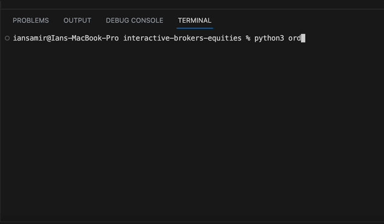
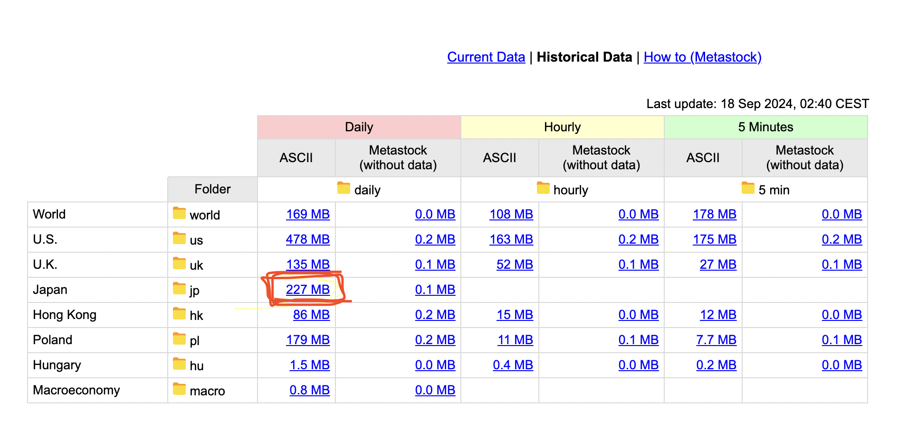
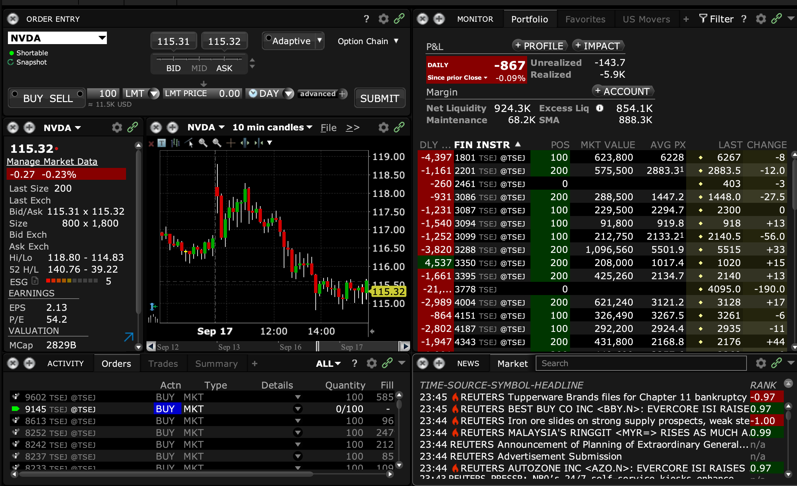

# Interactive Broker Japanese Trading 

Generate Japanese equity news sentiment signals from Alexandria SFTP and execute the trades with Interactive Brokers

### Model Training  
 - pip install -r requirements.txt
 - get Japanese equity data from [Stooq](https://stooq.com/db/h/) 
 
 - unzip the folder and navigate into data -> daily -> jp -> tse stocks
 - rename the folder tse_stocks and move it into model folder in this repo and name it tse_stocks, should have subfolders 1 and 2
 - python3 generate_signals.py 
 - Should save tickers to signals/longs.csv and signals/shorts.csv

### Order execution 
 - Make sure signals are in signals folder as longs.csv and shorts.csv
 - Login to Interactive Brokers Paper Trading Account on Trader Workstation desktop app 

 - python3 order_japan.py 